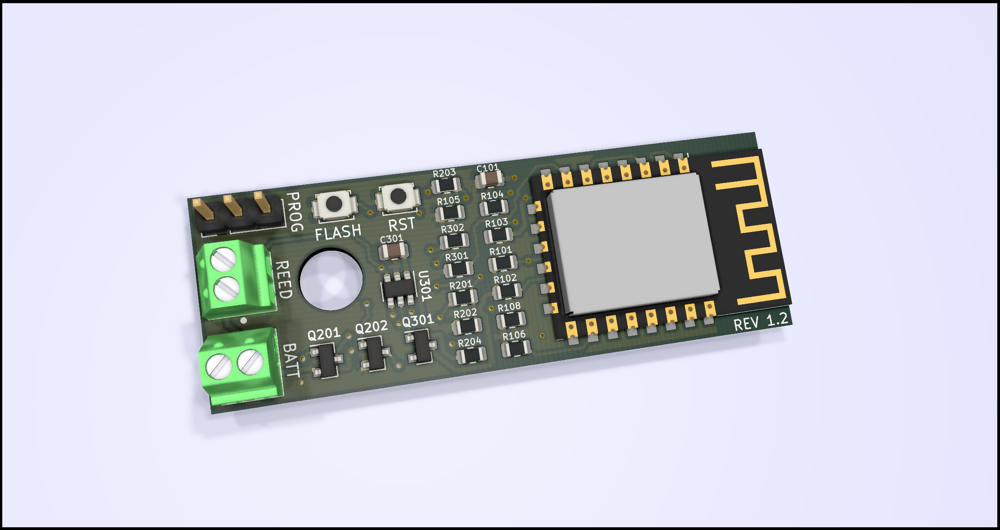

# ESP8266 low power door sensor

This design represents a small sensor intended to be triggered by a magnetic reed switch. It wakes upon closing the contact, reporting the information to the internet and going back to sleep. All while retaining minimum power consumption.

## PCB design

- [Schematic design](pcb/schematic/Door.pdf)
- [Gerblook](http://gerblook.org/pcb/ystvpxL37dVEFK4SQLsg35)

